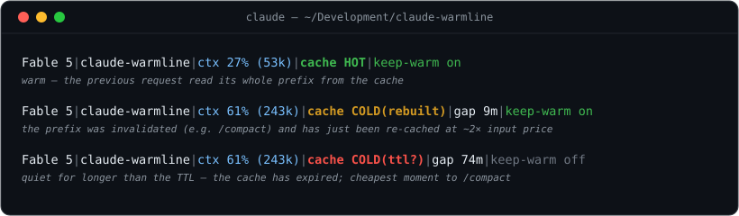

# claude-warmline

[English](README.md) | [日本語](README.ja.md) | [繁體中文](README.zh-TW.md) | **简体中文**

[](https://github.com/Miguel-Barroso/claude-warmline/actions/workflows/test.yml)
[](https://github.com/Miguel-Barroso/claude-warmline/tags)
[](LICENSE)

**warmline 让 Claude Code 的提示缓存状态可见。**

## Claude Code 会悄悄冷掉

一个正在工作的会话带着几万到几十万 token——系统提示、工具、它读过的每个文件、每一条
回复——而 Claude Code 每一轮都把这些全部重新发送。只要提示缓存还在，那段上下文就以
大约正常输入价格的 **0.1 倍**被*读*回来；一旦冷掉，同样的上下文就要以约 **2 倍**的
价格重新处理一遍。它会在大约一小时无操作后冷掉，也会在对话开头被改写的瞬间立刻冷掉
（`/compact` 与自动压缩都会这样做）。午饭后回到一个大会话，你的下一条消息就要重付
全部的重建成本——偏偏在你最想要结果的时刻，而会话本身不会告诉你。

**warmline 把缓存状态直接放到你的状态栏上，并给你工具去查看它在历史上的表现。**

```text
Opus 5 | claude-warmline | ctx 64% (127k) | cache HOT (127k, cold ~11:58) | 5h 78%
```

不靠猜测，也不靠计时推断。从 v2.1.251 起，Claude Code 会把它自己的 `prompt_cache`
对象交给状态栏——前缀是否是热的、走的是哪个 TTL、在哪一秒过期——warmline 只是把这个
对象里写着的内容显示出来。

至于这一轮之前的一切：

```text
warmline audit
```

会依据 Claude Code 记录的用量，为一个会话的每个 API 轮次评分；`--all` 则把本机所有
会话排序呈现。



## 安装

```sh
curl -fsSL https://raw.githubusercontent.com/Miguel-Barroso/claude-warmline/main/install.sh | bash
```

用 Homebrew 也可以：

```sh
brew install Miguel-Barroso/warmline/warmline && warmline setup
```

然后：

| 命令 | 作用 |
|---|---|
| `warmline status` | 当前安装并启用了什么 |
| `warmline audit` | 本项目最近一个会话，逐轮查看 |
| `warmline audit --all` | 本机所有会话，排序呈现 |
| `warmline watch` | 所有会话的热度，实时显示，直到 ctrl-c |

只需要 `python3` 和 `bash`，没有别的依赖。没有 `curl` 也行：`wget -qO- <同一个 URL> | bash`
效果一样，安装器自己下载文件时也会用它找得到的那一个。formula 有意只管到 `PATH` 为止——
包管理器不该背着你改写 `settings.json`，那一半交给 `warmline setup`；`brew upgrade`
之后重新跑一次。

[安装细节、参数、锁定发行版、包管理器、Windows →](docs/INSTALL.md)（英文）

## 为什么是 warmline

大多数 Claude Code 状态栏回答的是这类问题：

- 我在用哪个模型？
- 上下文还剩多少？
- 这个会话花了多少钱？
- 我在哪个分支上？

这些都有用。warmline 回答的是另一个：

> **提示缓存现在真的是热的吗？**

以及一个任何实时指示器都答不了的问题：

> **它是什么时候冷的、多久发生一次、值不值得在意？**

状态栏告诉你会话里正在发生什么。**warmline 告诉你上下文是否还在被复用。**

这里的一切都是为 10 万 token 以上的情况而存在。2 万 token 冷掉了重建也很便宜。

## 从可见到可控

**观察（Observe）**——缓存此刻的状态，来自 Claude Code 自己的数据，就在状态栏上。

**解释（Explain）**——`HOT`、`COLD`、`off` 和过期时刻各自意味着什么，其中哪些是你
能采取行动的。

**度量（Measure）**——`warmline audit`：历史上的冷事件、记录能证明原因时的成因，
以及它们大约值多少钱的估算。

**缓解（Mitigate）**——`warmline keep-warm`，仅当你确认自己确实需要时。

这是一个递进，而不是功能清单。它带你从*“我的缓存冷掉了吗？”*走到*“这多久发生
一次？”*，再到*“它贵到值得我在意吗？”*，最后到*“我想为此做点什么吗？”*——而最后
这一问，答案常常是不用。

前三项是只读的观测，也是本项目的重点。第四项需要主动开启，默认关闭，并且刻意设有
边界——见下方“可选：保温”一节。

## 观察：状态栏

```
Opus 5 | claude-warmline | ctx 64% (127k) | cache HOT (127k, cold ~11:58) | 5h 78%
```

| 字段 | 含义 |
|---|---|
| `ctx 64% (127k)` | 上下文窗口占用率——距离自动压缩真正触发的阈值（`窗口 - 33000` token）不足 10k 时变黄 |
| `cache HOT (127k, cold ~11:58)` | 缓存的前缀是热的，若变冷需要重写 127k token，并将在所示时刻离开它的 TTL；过期前 15 分钟内文字不变，只转黄 |
| `cache HOT 5m` | 同上，但走的是 5 分钟 TTL——按量计费额度、API key、云端供应商。1 小时是常态，因此不标注 |
| `cache COLD` | 前缀已在 TTL 之外；下一轮会把它重新缓存 |
| `cache off` | 提示缓存被关闭，或这个供应商/网关从不报告缓存 token。这里等多久都不会变热 |
| `cache ?` | 没有缓存数据——v2.1.251 之前的 Claude Code，或本会话第一次 API 响应之前 |
| `5h 78%` / `7d 91%` | 最接近上限的套餐额度窗口，低于 50% 不显示，转黄后附上重置时间。API key 与云端供应商没有套餐额度，因此不会出现 |

**warmline 不会通过测量 Claude Code 回复得多快来猜缓存是不是热的。** 上面每一个判定
都是 Claude Code 交给状态栏的字段：状态来自 `prompt_cache.warm`，分桶来自 `ttl`，
时刻来自 `expires_at`，重建规模来自 `recache_tokens_if_cold`，套餐额度来自
`rate_limits`。warmline 只负责排版和上色。它过去确实靠两轮之间的间隔来推断，
那套机制已经删掉了。真正能据以决策的是两个数字：**`(127k)` 是变冷要付的代价**——
下一次缓存写入的大小，它把“值不值得保温”从感觉变成数字；**`5h 78%`** 才是订阅用户
真正会用完的东西——中途打断工作的不是美元，而是套餐额度。`COLD`、`off` 和 `?` 是
刻意分开的：“缓存过期了”“根本没有在做缓存”“warmline 看不到”是三件不同的事，把它们
揉成一件，正是一个缓存仪表开始说谎的起点。

过期时间始终是绝对的墙上时钟，而不是倒计时——冻住的倒计时是*错的*，冻住的时钟仍然
是*真的*。从 `HOT` 到 `COLD` 的切换由 Claude Code 自己在过期的那一刻重绘状态栏完成；
安装器写入的 60 秒刷新间隔不是为了它，而是为了**让过期前的黄色警告在空闲时也能被
看到**。没有它，这一行依然正确，只是不再提前警告你。

[全部字段、颜色、故障排查 →](docs/STATUSLINE.md)（英文）

### 冷着回来时

缓存已经没了；无论你接下来做什么，那段上下文都会再以未缓存的价格处理一次。唯一的
问题是：这一次处理买到了什么？

- **你仍然需要对话历史 →** `/compact`。那次昂贵的处理反正也要发生；这样至少让它
  产出一份摘要，之后你可以廉价地携带它。
- **你的状态写在对话之外**（记忆文件、计划文档、代码）**→** `/clear`。它连摘要
  那一次都省掉。
- **上下文很小 →** 什么都不做。重建 2 万 token 很便宜。
- **绝不要在 `HOT` 时压缩**，除非上下文窗口已满：那会摧毁你已支付约 2 倍代价建立的
  缓存。

[完整推理 →](docs/AUDIT.md#when-you-come-back-cold)（英文）

## 解释与度量：审计

状态栏上的一个 `HOT` 有用。看到你的会话在 8 周里冷掉了 198 次，更有用。

`warmline audit` 依据 Claude Code 为每个已记录 API 请求写下的用量字段来评分——不像
状态栏，它没有一轮的滞后。`--all` 则对本机所有会话做同样的事并排序。（它运行的是已
安装的 `warmline-audit` 命令；两种写法都有效，已经写好的脚本继续可用。）以下是某台
机器 8 周历史的真实输出，为了让示例稳定而统一按 `--price 3` 计价——不带数值的
`--price` 会按项目求解你真实的单价：

```
$ warmline-audit --all --price 3
147 sessions under /Users/mb/.claude/projects  (13 more without API turns; ttl per session from its cache buckets, 60m fallback)

cache health  █████████████████████████░  95% hot  (10,394 of 10,921 turns)
cold events   198  (159 rebuilt, 39 ttl) -- 1.8% of all turns

start        project                 turns    hot  part  rebuilt   ttl  avoidable cold  share    premium
08-07 14:30  MimirBlue                 201    189     6        4     2       1,294,770    11%      $7.38
   ⋮
TOTAL                                10921  10394   329      159    39      12,134,109   100%     $69.16

where the cold came from
  unknown             ██████████████████████████  92 (39%)
  session start       █████████████████  59 (25%)
  auto-compact        ██████████  37 (16%)
  inactivity          █████████  31 (13%)

estimated avoidable premium ~$69.16  (top 5 sessions: $21.36, other 142: $47.81)
```

这就是可观测性与装饰性状态栏的差别：一个你能据以行动、或据以决定不行动的模式。

每个冷轮次都会在记录能**证明**的范围内附上原因——`/compact`、`auto-compact`、
`model change`、`inactivity`——其余的一律落进 `unknown`，而它是**残差桶，不是结论**：
记录里没有留下证据，所以 warmline 拒绝给它安一个原因。Anthropic 记录了好几种记录
永远看不见的前缀失效操作——改变思考强度、打开 fast 模式、拒绝整个工具、启用或停用
插件、连接会把工具载入前缀的 MCP 服务器，以及升级 Claude Code 本身——它们都会落到
这里。会话中途编辑 CLAUDE.md 不会：Anthropic 把那一项列在*保住*缓存的操作里。在这台
机器上，`unknown` 占了冷事件的 39%，比所有压缩加起来还多，而最糟的单个会话独占总量
的 11%——这应当读作“占比最大的部分尚未得到解释”，那是去查的理由，而不是诊断结论。
（判定来自记录的用量，但 `COLD(rebuilt)` 与 `COLD(ttl)` 之间的划分取决于 TTL——它按
会话从各自的缓存分桶记录中自动检测。）

**这些金额是从你自己记录中的 token 数推算出的风险敞口估计，不是账单数据**——
warmline 从来看不到、也无法看到 Anthropic 实际向你收取了多少。报告最后一行标为
`estimated avoidable premium`，其中的“avoidable（可避免）”仅指*排除每个会话无法
避免的首次缓存写入之后*的部分：它统计到的一些情况在实践中并不可预防，例如笔记本
休眠期间发生的 TTL 过期。

**warmline 不附带价目表。** 写死的价格会过时，而且在你从 Sonnet 换到 Opus 的那一刻
就是错的。不带数值的 `--price` 会直接求解你实际支付的基础输入单价：用 Claude Code
自己为该项目上一次会话记录的费用，配合每个 Claude 价格档共有的倍率（输出为基础输入
的 5 倍，1 小时缓存写入 2 倍，5 分钟写入 1.25 倍，热读取 0.1 倍）。`--all` 会用各
项目自己的单价分别计价，每份报告都会写明数字的来源；`--price N` 仍可覆盖。输出
token 从不进缓存，因此审计把它单列一行，而不是假装保温能省下它。

审计评判的是过去，而 **`warmline watch`** 展示的是现在：所有会话热度的实时视图，
持续重新渲染直到 ctrl-c。桌面应用的会话也会出现在其中——它们虽然无法渲染状态栏，
写出的却是同样的记录文件。

[完整讲解、判定、原因、`--all`、`--live`、`--json` →](docs/AUDIT.md)（英文）

## 可选：保温（Keep Warm）

以上全是观测。Keep Warm 是可选的第四项能力：放在 `~/.claude/CLAUDE.md` 里的一段
简短指令，告诉智能体在漫长而安静的等待期间大约每 50 分钟 ping 一次，好让结果回来时
缓存仍是热的。

```sh
warmline keep-warm on        # 默认关闭；全局生效；可随时撤销
warmline keep-warm status    # ON / OFF / INCONSISTENT（退出码 0 / 1 / 2）
```

它**不是守护进程**——没有 cron、没有常驻进程，也不会在运行中的 Claude Code 会话
之外发出任何请求。当后台任务已经免费让缓存保持热度时它会跳过，代价很小时也跳过，
走 5 分钟缓存时同样跳过——那需要每小时约 12 次 ping，比它能省下的 1.15 倍重建还贵。
工作一恢复就停止，并在大约 10 小时后放弃。每次 ping 都是一次针对你自己套餐的普通
计费请求：它用几次廉价读取换掉一次昂贵重建，不绕过任何限制。

更好的是，只要这台机器能看到那份等待，就根本不必预约 ping：

```sh
warmline wait-for --pidfile /tmp/job.pid --until-cold
```

它会在任务结束**或**缓存即将过期时返回，以先到者为准。期限读自本会话自己的记录，
所以 12 分钟就结束的任务一次 ping 也不用发。

[它是什么、不是什么、`wait-for`、免睡眠模式、限制与条款讨论 →](docs/KEEP-WARM.md)（英文）

## 本地优先，是设计如此

warmline 只在你自己的机器上运行。它不向外发送数据、不收集遥测、不需要账号，除
`python3` 和 `bash` 之外没有任何依赖。

它展示的一切，都来自 Claude Code 已经写在本地的数据：Claude Code 传给状态栏的 JSON，
以及 `~/.claude/projects` 下的会话记录。**warmline 观察的是 Claude Code 在本地公开的
东西**——它对 Anthropic 的任何后端都没有特殊访问权限，也没有任何需要登录的地方。

## 在哪些地方有效

| 前端 | 状态栏 | `warmline audit` / `watch` | keep-warm |
|---|---|---|---|
| 终端 CLI | ✅ | ✅ | ✅ |
| 桌面应用（本地 Code 标签页） | ❌ | ✅ | ✅ |
| VS Code / JetBrains 面板 | ❌ | ✅ | ✅ |
| 云端 / Cowork 会话 | ❌ | ❌ | ❌ |

本地的图形前端不会渲染自定义状态栏（[已提出的需求](https://github.com/anthropics/claude-code/issues/41456)），
但它们在本地运行同一个引擎、共享同一个 `~/.claude`、写出同样的记录文件，因此审计
工具、`warmline watch` 和保温策略在那里照常工作。**唯一的例外是云端 / Cowork 会话：
warmline 的任何部分都触及不到它们。**

[完整对照表与验证方式 →](docs/SURFACES.md)（英文）

## 实测证据

- **闲置 50 分钟：热的。70 分钟：冷的。** 在无干扰环境下的双臂探测中，50 分钟后的
  探针读回了完整的 71,312 token 前缀，70 分钟后则重写了 45,033 个 token。一小时的
  TTL 是真的，而且读取会刷新它。
- **147 个会话、10,921 个轮次的审计**（同一台机器）：95% 为 hot，但其中 39% 的冷事件
  **没有归到任何原因上**——那是记录未能提供证据的残差，不是一个有名字的成因。

[数据、方法、如何复现 →](docs/MEASUREMENTS.md)（英文）

## 文档

详细文档仅提供英文版。

| | |
|---|---|
| [Statusline](docs/STATUSLINE.md) | 全部字段、颜色、故障排查 |
| [Audit](docs/AUDIT.md) | 判定、原因归因、`--all`、实时的 `watch` 视图、"avoidable" 的定义 |
| [Keep Warm](docs/KEEP-WARM.md) | 策略、免睡眠模式（`warmline awake`）、限制与条款讨论 |
| [Where it works](docs/SURFACES.md) | 终端、桌面、IDE、SSH、云端 |
| [Install](docs/INSTALL.md) | 安装、更新、卸载、配置、Windows、测试 |
| [Measurements](docs/MEASUREMENTS.md) | 支撑每一项主张的实测数据 |
| [Changelog](CHANGELOG.md) | 带标签的版本 |

## 许可证

[MIT](LICENSE)

## 请我喝杯咖啡 ☕

BTC: `bc1qjsvtd3dd44llyu4rwz2ucl4kp9wd9kvpsj6tk5`
